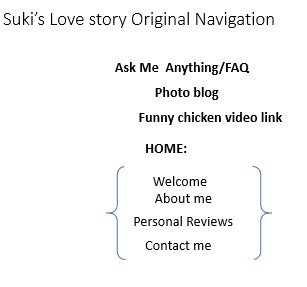
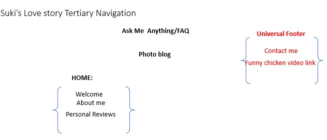

# Project 1: Design Journey

## Audience & Content

**Make the case for your decisions using concepts from class, as well as other design principles, theories, examples, and cases from outside of class.**

You can use bullet points and lists, or full paragraphs, or a combo, whichever is appropriate. The writing should be solid draft quality but doesn't have to be fancy.

**No sketches are required for Milestone 1.**

### Website Topic (Milestone 1)
> Briefly explain what your website will be about.
A love/family blog/photo alblum for my cranky pet rooster Suki. It will be written from the perspective of a cute technolophille rooster and his adventures on the internet and in love.

### Audience (Milestone 1)
> Briefly explain who the intended audience(s) is for your website. Be specific and justify why this audience is appropriate for your site's topic.

Tech savvy chickens interested in the love adventures of rooster Suki. Just kidding! The site content is catered towards chicken enthusiasts/owners of pet roosters. This is because chicken lovers can relate/care about  chicken stories. Some audiences may also come from legitmite dating blogs (i.e. someone who reads dating blogs regularly). This is because my website is a lighthearted parody of dating blogs, and audiences familiar with dating blogs might find it interesting to read about a silly rooster trying to find love.

### Final Content (Milestone 1)
> Briefly describe the content you plan to include in the final site, and why it's the right content for your audiences.

I plan to include:
- photo journal/blog with chicken "selfies"
- this is good content because I hope to reveal Silkie's personality through these posts--its also the main place where I plan to tell the stories of Silkie's adventure (i.e. the reason why my audience is here in the first place)
- Ask me anything section (FAQ)
- This is important because even to my audiences (romance bloggers and chicken fanatics) having a rooster writing blogs is really unusual so it would make sense for my audience to want to ask questions/read about existing questions regarding Suki.
- (chicken/love related)Quote Board and Favorite (chicken related) Video of the Week
- I think it fits well with the lighthearted theme of the website, I also think that audiences would find it funny (chicken/love related entertainment)
- A twitter account I made just for this project!!
- I think this would be the right content because it makes Suki seem more real to audiences--thus making the experience much more interesting for all parties.

### Home Page Content (Milestone 1)
> Briefly identify what content you will include on the homepage and why this content should be the first thing your target audience sees when they visit your site.
- Home Page with a couple of photos of silkie, some "About me" kind of blurbs and some funny reviews!!
- This is important because this is basically a full dose of the kind of humor and content that I plan to put into my website.
- my target audience of chicken lovers and bloggers need to know immediatly what my website is about (otherwise they would just be confused)--so I made sure to put the "About me " section right on the homepage

## Information Architecture

**Make the case for your decisions using concepts from class, as well as other design principles, theories, examples, and cases from outside of class.**

Each section is probably around 1 reasonably sized paragraph (2-4 sentences).

**No sketches are required for Milestone 2.**

### Audience (Milestone 2)
> A clearer description of audience: who are they, what are they interested in with respect to this site, and what are the design goals for that audience.

My audiences are chicken enthusiasts or love bloggers that enjoy reading about anthropomorphic animals and parodies of dating blogs.

My chicken/rooster enthusiasts would probably be most interested in the stories included in my photo blogs/pages due to their familiarity with raising chickens. They would pay the most attention to the rooster/chicken-like behaviors described in each blog (i.e., they probably would not be happy about a blog where Suki goes diving in the ocean since chickens can't swim). In other words, these people probably would want to know specific details about Suki like his height/size (different rooster breeds come in different sizes), his temperament, the size of his flock, where he lives (his roost), etc.. They probably would also have an interest in the photos featuring Suki.

My dating blogger audience would probably be most interested in the small details scattered around the site that imitates the format of typical dating blogs (the FAQ, the blog posts, the twitter links, etc.). While they may read the content of the blogs, they probably have more of an interest in the novelty of the website, rather the story of the little rooster. Thus, these dating bloggers probably would spend more time scrutinizing the structure and features of the website rather than the content.

### Organization & Navigation (Milestone 2)
> A description of how you generated and considered alternatives for the site's content organization and navigation. You are required to include images here of your card sorting for determining the organization of content and the navigation.

> Thoroughly document this process. The _process_ is the important part of this assignment, not the final result.]

Originally I wanted my website to follow a pretty generic dating blog format--I thought I was just going to have a home page that was basically a stream of blog posts, and an about me page. However, as I did more research/field work reading/finding popular dating blogs and analyzing their content/structure my original ideas changed a lot.

I took a lot of inspiration from dating blogs for the kinds of pages that I would like to include for Suki. This is how I came up with the idea of including dating profile page, FAQ, photo blog...etc. I also really appreciated the dating blogs that had a goofy/quirky tone/style to them (i.e. memes or funny writing..etc.) and it inspired me to include a funny link in the navigation that brought the user to a funny chicken related video. So I came up with the following design:

However the more I thought about my audience the more I realized that my visitors would probably rather have the blog focused more on the dating life of the rooster than it was about the funny quirky bits of the site (i.e. the chicken video link). So, I decided to move the video to the footer, along with the Contact Me.

However upon analysis of dating blogs I realized that my dating blog visitors would probably be interested/pleased to find the obligatory/common FAQ web page found in so many dating blogs. Thus, I decided to put the FAQ section back into the navigation (and out of home).

### Final Organization and Navigation (Milestone 2)
> Explain how the final organization of content and navigation is appropriate for your target audiences.

This final organization content is appropriate for my chicken lovers and dating bloggers because it presents the most interesting part of the website (stuff that they would care about--i.e. the chicken blog for the dating bloggers and information about the chicken for the chicken lovers). Furthermore the way I moved the my "funny chicen video link" to the less prominent footer allows me to the goofyness that I think my audiences will find amusing (after exploring the other more important bits of the website).

## Visual Design

**Make the case for your decisions using concepts from class, as well as other design principles, theories, examples, and cases from outside of class.**

Remember to focus on the things we can't see just by looking at the site: changes, alternatives considered, processes, and justifications.

Each section is probably around 1 reasonably sized paragraph (2-4 sentences).

### Theme Ideas (Milestone 3)
> Discuss several ideas about styling your site's theme. Explain why the theme ideas are appropriate for your target audiences. Feel free to include some hand-drawn sketches (not digital drawings, not mock-ups, not wireframes, etc.) here to document your design process.

Overall I decided that I want all of my themes to be very bright and cheerful. I think bright colors would target both my chicken-lover and love blogs audences' expectations for a funny/lighthearted experience when using my website. In my search for the right colors I came across a website https://www.wealthsimple.com/en-us/ that I felt had a great color selection. Althought the website did not have the same audience as mine, I felt like the muted pastel theme that it had could resonate strongly with my chicken/farming audiences who are familiar with earthy muted tones. I also appreciated how bright the colors were which would help my website exude a cheerful emotion that cater towards my love blog readers (who come to read good funny romance stories). Another source of theme design ideas came from looking at the photos on my blog. Since my audiences were interested in Suki, I felt like perhaps picking colors sourced directly from his photos would be a good approach. From this I ended up with a lot of bright earthy tones that could resonate well with my chicken loving audiences.

### Theme Design (Milestone 3)
> Discuss your theme designs: how did you come to them, what are their strengths and weaknesses, how do they fit your overall design goals and audiences?

> Emotion is a big part of design. What emotions where you thinking about or trying to convey in your designs?

One idea that I had was to create a friendly rustic theme (theme1). To do this I would use a combination between cursive and serif fonts that emulate an old-fashoined/rustic feeling. I would also use bright muted pastels that exude an earthy/chearful emotion. I think this would cater towards my audiences who are familiar with raising chickens. This is because the chicken raising community tend to be more of the DIY oriented kind of folks, therefore they would resonate a lot with a theme that is similar to "Better homes and Gardens" magazines.

Another idea that I had come up with was to do a more minimalist theme (more greys and whites) (theme2). From this theme I wanted to exude a more calm/zen approach to the website. I felt like my love blog audences would appreciate this because the simplicity of a calm and controlled theme would allow them to access the blog stories without much distraction. This minimalist theme would still be appropriate because it would have occasional bright chearful colors that would bring that punch of fun to the website.

## Rationale

**This rationale should be polished writing: one you might submit as a report to a client or boss to help explain the project and convince them you did a good job. You'll be surprised how much writing and communicating you need to do about projects and choices on internships and jobs; practice that here.**

It should be a comprehensive, complete story of the project. You might find that each section runs a few paragraphs (1-2). Sketches can often help tell the story of your design. Screenshots are also useful for describing issues discovered during the design process and how you addressed them.

**All images must be visible in Markdown Preview for credit!**

Your rationale should be a polished version of the earlier explanations.

### Site Layout (Final Submission)
> Show your design process and final layout for your site. You must include photos of your sketches of the layout. No digital drawings permitted.

> You must label each figure and provide an explanation of the sketch.

First sketch for home page. Contains a complex combination/layering of horizontal and vertical flex boxes. The website would have a grid of blog posts. Ultimately I decided that this was not appropriate for my blog-reading audiences, because each blog story should be read in chronological order, which is hard to orient when placed in a grid. A vertical scroll of blog posts would make most sense for this purpose.

My final webpage designs. I decided that a vertical alignment would guide my audience's eyes the best to allow them to better navigate through my blog posts. Since my posts are ordered in chronological order this alignment also makes logical sense.

### Audience (Final Submission)
> A complete and polished description of the intended audience(s) for your website.

My website is a photo-journal love blog written in the perspective of my pet rooster Suki. My intended audiences are chicken (the animal, not the food) and love blog enthusiasts who are casually looking for something short, lighthearted, and entertaining to read. These people should respond favorably towards pictures of cute chickens, and be familiar with some aspects of raising chickens. They should also enjoy reading internet stories following anthropomorphic animals. In addition, I expect my audience to be people who are looking for momentary entertainment—something that can keep them somewhat busy/occupied for a few minutes.

### Design Goals (Final Submission)
> An explanation of the design goals for that audience, based on your earlier rationales.

Since my audiences are looking for fast entertainment, one of my design goals is to feature engaging elements related to my rooster most prominently. For instance, this would include making it easy for my audiences having immediate access to his blog posts, as well as including smalls blurbs guiding the reader through the website that allow the “personality” of Suki to be revealed.  Another form of engagement would be through featuring photos of Suki throughout the website. These photos would provide another source of entertainment for my audiences. In addition, my chicken enthusiasts would be interested in learning more about the specific breed/type of chicken Suki is, therefore a priority would be to also provide serious information about Suki.
Another design goal is for my website to have a cheerful ambiance. This reflects the interest of my audiences who come to my website for wholesome entertainment featuring my pet rooster.
A smaller design goal would be to scatter small details that imitate the format of popular web blogs. This would cater towards my audiences who are familiar with dating-blog formats, because it would allow them to engage with “Suki” through things like social media links.

### Navigation (Final Submission)
> An explanation of how the final navigation met your goals and why its appropriate for your audience(s).

My final navigation met my goals because it provided an organized way for my audiences to gain easy access to important areas of my website. After several redesigns I ultimately settled on a very simplified navigation (I got rid of unnecessary pages like one dedicated to a funny chicken video, and one dedicated to site reviews). This is appropriate because my audiences do not have a lot of time to spend on my website. Therefore, they would not be entertained by anything that is unrelated to what they came to the site for: stories about my pet rooster Suki. Having too many pages with miscellaneous content (though it may be entertaining) is inappropriate in this context.
Thus, it makes a lot of sense for my website to only have 3 links: a Home link that leads to the home welcome page, a Photo Blog link that leads to a page containing all the blog posts in chronological order, and a About Me link that brings the audience to a page that provides humorous and serious information about Suki. This fits well with my audiences’ interests in learning more about Suki, as story/blog-readers and chicken enthusiasts.

### Organization (Final Submission)
> An explanation of how the final organization met your goals and why its appropriate for your audience(s).

My final organization meets my goals since it very directly addresses my audience’s interests/reason for visiting my site. The homepage immediately features a “Welcome!” blurb that introduces Suki as well as the website in a humorous manner. The “Welcome!” blurb addresses new readers, and refreshes older viewers about the site. Immediately after, the website guides the reader to clickable previews of the recent web blogs in chronological order—which for returning audiences is their main reason for using my site. In my later adjustments of my homepage I removed a secondary blurb that served the purpose of an “About me”. I did this because for returning viewer’s the “Welcome” blurb should be enough to remind them of who Suki is. I moved the “About me” content under the page of “Ask me Anything”.

The way the “Ask me Anything” page is organized is very simple. The “About me” provides more (detailed) information about Suki, and below the “About me” is a FAQ section that contains serious information about Suki. For members of my audience (chicken enthusiasts) curious to find out more about the breed, size, flock of Suki and family, this “Ask me Anything” page gets straight to the point.

My final “Photo Blog” is simply a page that contains all of Suki’s blogs. The chronological organization of the webpage allows my audiences to have an easy time following the story between each blog. The simplicity of this page is to mainly allow audiences to navigate through the stories without getting lost.

### Visual Design (Final Submission)
> An explanation of how the final design met your goals and why its appropriate for your audience(s).

To address my goal of creating a website that is engaging for an audience with a short attention span (i.e. fast entertainment) I decided to keep my website visually simple and eye-catching at the same time. Since my audiences are looking for a cheerful happy website, I choose to use bright vibrant colors to highlight major affordances on my website (i.e. my “Welcome section!”, the blogs…etc). Due to how I chose to keep my organization of each page simple, it was not hard to incorporate engaging website elements (i.e. each brightly-colored section of the website) while looking cluttered. To better guide the user’s eye though my pages I chose to use a flat white background for my website. This emphasizes the presence of the more important parts of the page.
Originally, I had another theme that featured more earthy colors. I ultimately decided that this was a poor choice due to how the muted colors took away from the energy and cheerfulness portrayed in the website’s content and my audience’s expectations.

I choose to style the borders of each “box” in an unconventional swerving/curved shape to further portray the theme of lighthearted playfulness that my audiences are looking (after all the are here to get some wholesome entertainment).  The non-conventional shapes of each box also add an element of interest/dynamic movement to the page which makes the website more entertaining to read for my audience.

 For my font I decided to combine both cursive style and sans-serif fonts. I choose a cursive font for the website header to bring a friendly warmth to the website. The cursive font also relates well to the rustic nature of the websites content—and reflects my audience’s background/interest in raising chickens. For the rest of my website’s body I chose to use sans-serif fonts mainly due to the legibility/cleanliness of sans-serif fonts. Since my audiences are here for fast entertainment it would be best to use a font that is easy and fast to read.

### Self-Reflection (Final Submission)
> What did you learn from this assignment? What are some of your strengths and weaknesses?

In this assignment I learned about the difference between visual design and organization. In the beginning I had a hard time understanding how designing “visually” is different from designing the website’s organization. However, after this experience I learned the significance of portraying “emotions” and using colors and contrast to better convey a website’s content. In the process I also learned why it is important to be able to distinguish what one wants to do visually and organization-wise. My strength lies in visual design, and my weaknesses lie in making good organizational choices.
